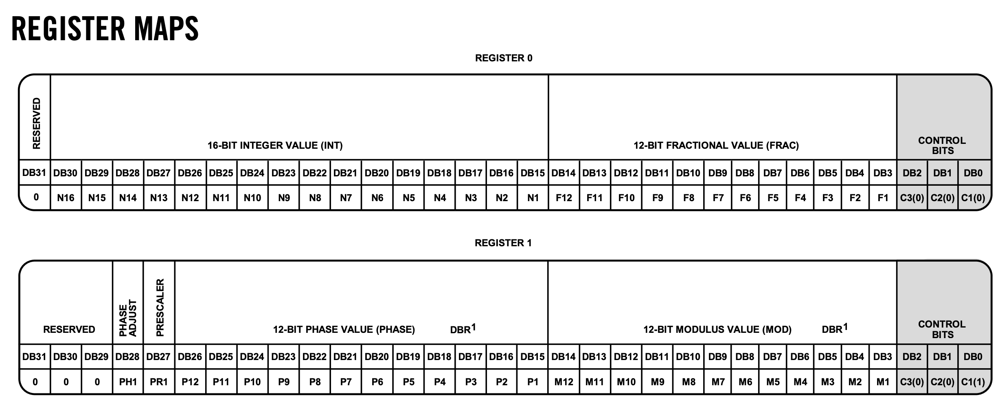
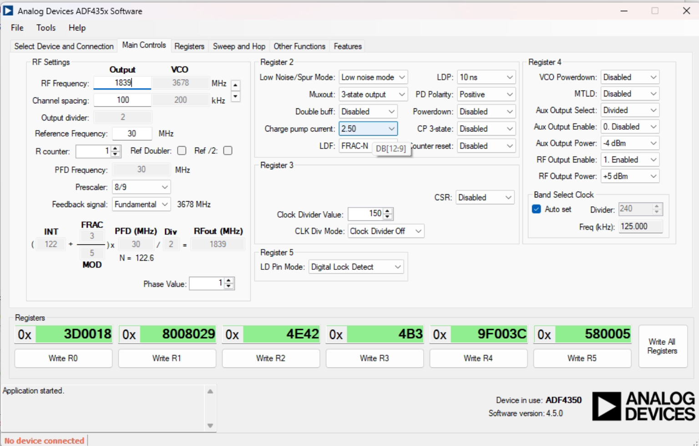

# ADF4351 Register Calculator (Python)

## Overview

This project provides a small, self‑contained Python function, `adf4351_registers()`, that converts an arbitrary RF output frequency into the six 32‑bit control‑word values (R0 … R5) required by the Analog Devices **ADF4351** wideband PLL synthesizer.
The calculator is tailored for a 30 MHz reference clock and a 100 kHz channel‑spacing grid—settings that match the typical demo‑board configuration.




From : https://chatgpt.com/canvas/shared/6832cc78ec308191b9f95f856cce4697
---

## Files

| File                    | Purpose                                                      |
| ----------------------- | ------------------------------------------------------------ |
| `adf4351_registers.py`  | Core algorithm ‑ no external dependencies except `math`.     |

*(The demo that appears in ChatGPT uses `pandas` and `ace_tools` only for pretty display—you can omit these in standalone code.)*

---

## Quick Start

```bash
python - <<'PY'
from adf4351_registers import adf4351_registers
regs = adf4351_registers(1_839_000_000)  # 1.839 GHz example
print(regs)
PY
```

Expected output (hex strings, MSB‑first):

```
['0x003D05A0', '0x08008961', '0x00004E42', '0x000004B3', '0x009F003C', '0x00580005']
```

Send the words to the part over SPI in the order **R5→R0** (ADF4351 latches the CTRL bits DB2\:DB0 on the falling edge of LE).

---

## How the Algorithm Works

### Governing Formula

```
RFout = (INT + FRAC / MOD) × fPFD / RFdivider
```

* **fPFD** is the Phase‑Frequency Detector rate (30 MHz here).
* **RFdivider** is set (\*/1 to \*/128) so the internal VCO remains within 2.2–4.4 GHz.
* **INT** = ⌊VCO / fPFD⌋
* **MOD** = fPFD / channel‑spacing (≤ 4095 for the ADF4351).
  With 100 kHz step, **MOD = 300**.
* **FRAC** = round((VCO − INT·fPFD) / channel‑spacing)
* If *FRAC = 0* the code automatically enters integer‑N mode by forcing *MOD = 1*.

### Fixed Register Bits

| Register | Fixed bits in this implementation                          |
| -------- | ---------------------------------------------------------- |
| R2       | Low‑noise / spur‑optimised; charge‑pump 2.5 mA; LDF=FRAC‑N |
| R3       | Clock‑divider off                                          |
| R4       | RF‑output enabled, +5 dBm; AUX off                         |
| R5       | Static per datasheet                                       |

Adjust these constants if your hardware needs a different charge‑pump current, power‑down options, or AUX output.

---

## Function Signature

```python
def adf4351_registers(freq_hz: float,
                      ref_hz: float = 30e6,
                      chan_spacing: float = 100e3) -> list[str]:
    """Return six 32‑bit register hex strings for the desired RF frequency."""
```

* **freq\_hz** – Desired RF frequency in Hz.
* **ref\_hz** – Reference crystal/TCXO frequency.  (Change if not 30 MHz.)
* **chan\_spacing** – Channel spacing (step size) in Hz.

---

## Hardware Integration Tips

* Drive **LE**, **DATA**, **CLK** with standard 3‑wire SPI (MSB‑first on each 32‑bit word).
* Program R5 → R0 sequentially on every frequency hop.
* Allow ≥ 10 µs after the final LE rising edge before enabling the output switch or counting on lock detect.
* For lower spurs, keep the reference clean; add a 10 MHz OCXO + doubler if ultra‑low phase noise is required.

---

## ESP32 / Arduino C++ Driver

A ready‑to‑drop driver (`ADF4351.cpp / ADF4351.hpp`) mirrors the Python algorithm so you can call one line from your firmware:

```cpp
#include "ADF4351.hpp"

ADF4351 synth(/*LE=*/ 5, /*DATA=*/ 18, /*CLK=*/ 19);   // GPIOs

void setup()
{
    synth.begin();              // sets pin modes, defaults, etc.
    synth.updateFrequency(1.800e9);   // 1.800 GHz ─ writes R5…R0
}
```

### Public methods

| Method                           | Description                                             |
| -------------------------------- | ------------------------------------------------------- |
| `begin()`                        | Configures GPIO, writes power‑up registers (mute)       |
| `updateFrequency(double freqHz)` | Full re‑tune; handles RF‑divider and INT/FRAC/MOD maths |
| `void powerDown(bool en)`        | Optional, drives the PD pin via register 2              |

Internally `updateFrequency()` simply wraps `calculateRegisterValues()` then clocks the six words out MSB‑first:

```cpp
void ADF4351::updateFrequency(double fHz)
{
    uint32_t reg[6];
    calculateRegisterValues(fHz, reg);
    for (int i = 5; i >= 0; --i) WriteRegister(reg[i]);
}
```

`calculateRegisterValues()` is identical to the Python reference: auto RF‑divider, reduced fraction, `MOD = 2` for integer‑N.

> **Timing:** default `WriteRegister()` toggles LE high‑low at ≈ 1 µs intervals.  The ADF4351 needs only 10 ns min, so there is plenty of margin.

---

## License

MIT License—see `LICENSE` file for details.

---

# ODMR Server Web Interface Build System

This directory also contains the ODMR server firmware with an automated web interface build system.

## Development Workflow

### 1. Edit HTML/CSS Files
Edit the web interface files in `src/website_html/`:
- `index.html` - Main landing page with multi-language support
- `messung.html` - On-device measurement page
- `messung_webserial.html` - WebSerial measurement page
- `justage.html` - Photodiode alignment page with live intensity monitoring
- `infos.html` - Information page
- `style.css` - Global styles

### 2. Build Header Files
Run the build script to convert HTML/CSS files to C++ header files:

```bash
python3 build_website.py
```

This script automatically:
- Converts all HTML and CSS files to header files
- Generates version information with build date and git hash
- Optimizes and converts images to header files
- Creates PROGMEM arrays for efficient ESP32 memory usage

### 2a. Image Optimization (Optional)
If you need to optimize images manually:

```bash
python3 optimize_image.py  # Optimizes NVGitter.png to 300px (43KB)
python3 convert_image.py   # Converts optimized image to header file
```

Images are automatically optimized to 300px width and converted to RGB format to reduce size for ESP32C3 compatibility.

### 3. Flash Firmware
Use PlatformIO to build and flash the firmware:

```bash
# For ESP32-S3
pio run -e seeed_xiao_esp32s3 --target upload

# For ESP32-C3 (with improved serial)
pio run -e seeed_xiao_esp32c3 --target upload


# 1. Alles bauen
pio run -e seeed_xiao_esp32c3 && pio run -e seeed_xiao_esp32c3 -t buildfs

# 2. Mergen
pio run -e seeed_xiao_esp32c3 -t mergedbin

# Output: build/fw-images/seeed_xiao_esp32c3.bin  → direkt an 0x0 flashen
/Users/bene/.platformio/penv/bin/pio run -e seeed_xiao_esp32c3 -t upload_merged --upload-port /dev/cu.usbmodem101 

/Users/bene/.platformio/penv/bin/python -m esptool \
  --chip esp32c3 -p /dev/cu.usbmodem101 -b 460800 \
  write-flash --flash-mode keep --flash-freq keep --flash-size keep \
  0x0 build/fw-images/seeed_xiao_esp32c3.bin
```

## Features Implemented

- ✅ **LED Status Indicators**: White (no client), Rainbow (connected), Red (measuring), Blue (intensity mode)
- ✅ **Frequency Range Fix**: 2.2-4.4 GHz range properly enforced
- ✅ **ESP32-C3 Serial**: TinyUSB CDC with 1024-byte buffers
- ✅ **Live Intensity Monitoring**: Real-time photodiode readings for optical alignment
- ✅ **Multi-Language Support**: German/English with localStorage persistence
- ✅ **Automated Build System**: HTML→Header conversion with Python script
- ✅ **Image Support**: Optimized PNG images served from header files (43KB, ESP32C3 compatible)
- ✅ **Root Path Handling**: Explicit "/" route to prevent redirection issues
- ✅ **Version Information**: Build date, git hash displayed on website and available via /version endpoint
